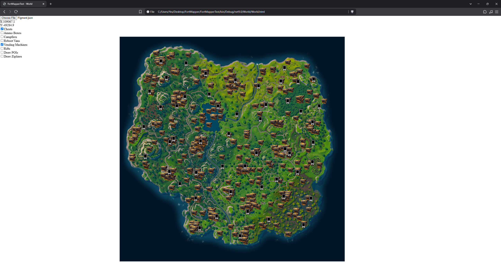
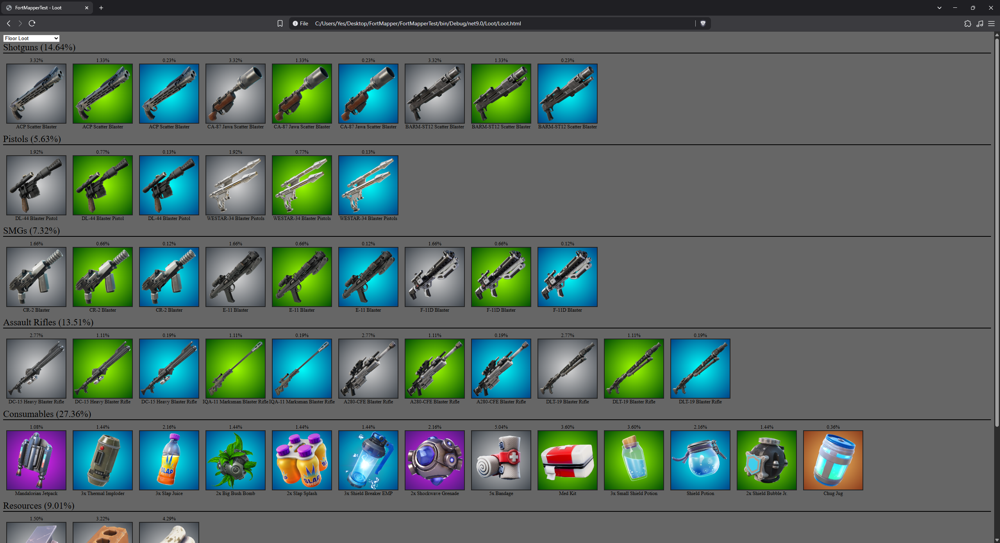

# FortMapper
A program to export stuff in fortnite like loot pool and map positions

## WorldExport
Open the minimap of a fortnite map and scroll/zoom while you can view positions of Chests, Ammo boxes, Vending machines, etc.

## LootExport
View the lootpool of a certain gamemode and see the chest/floorloot drop percentages, etc.
